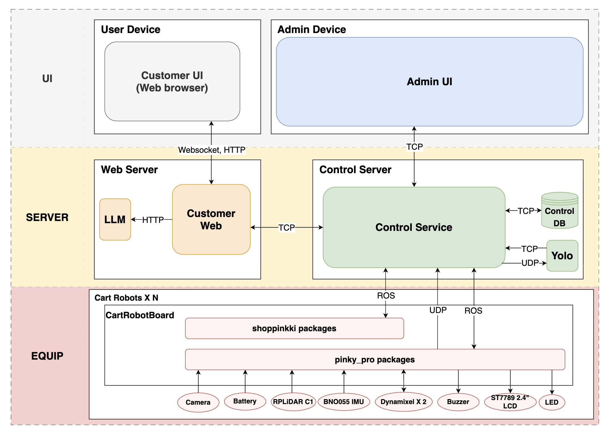

# 쑈삥끼 (ShopPinkki)

> **에드인에듀 자율주행 프로젝트 2팀 | 팀명: 삥끼랩**

Pinky Pro 로봇 기반 미니어처 마트 스마트 카트.
고객을 인식하고 따라다니며, 상품을 검색·안내하고, 결제·복귀까지 자동으로 처리합니다.

---

## 발표 자료 & 데모

📊 **발표 자료** — [shoppinkki-presentation.netlify.app](https://shoppinkki-presentation.netlify.app/)

🎬 **최종 데모 영상**

https://github.com/user-attachments/assets/d13a5720-cdfd-4cad-bbf7-157f4f9c5c15

---

## 핵심 기능 7가지

| # | 기능 | 짧은 설명 |
|---|---|---|
| 1 | **로그인** | LCD QR → 웹앱 접속 → 본인(데모는 인형) 등록 → IDLE→TRACKING |
| 2 | **추종** | YOLOv8 → ByteTracker → ReID(512차) + HSV(48차) 매칭 → P/PI 제어 |
| 3 | **상품 가이드** | 키워드 매핑 → LLM(Ollama Qwen2.5 3B)+pgvector → 구역 ID → Nav2 자율주행 |
| 4 | **장바구니** | QR 스캔으로 상품 추가 / 목록 직접 삭제 / WebSocket 실시간 동기화 |
| 5 | **대기** | TRACKING→WAITING 전환, 사용자 자유 이동, 시간 초과 시 자동 복귀 |
| 6 | **결제** | 결제 구역 진입 시 자동 팝업, 미결제 시 출구 Keepout으로 차단 |
| 7 | **복귀** | 빈 충전 슬롯 자동 탐색 → RETURNING → 도크 진입 → 세션 종료 |

---

## 시스템 구성

## 하드웨어

| 항목 | 사양 |
|---|---|
| 로봇 플랫폼 | Pinky Pro × 2대 (#54, #18) |
| 컴퓨팅 | Raspberry Pi 5 (8GB) on each |
| 센서 | RPLiDAR A1, Pi Camera, IMU |
| 구동 | Dynamixel 2륜 + LCD + LED + 부저 |
| 크기 | 110 × 150 × 142 mm |

## 데모 환경

- 미니어처 매장 188 × 141 cm — 동시 운용 로봇 2대
- **상품 구역 8개**: 가전, 과자, 해산물, 육류, 채소, 음료, 베이커리, 즉석식품
- **특수 구역 5개**: 화장실, 입구, 출구, 결제구역, 충전소(P1/P2)

---

## 기술 스택

| 분야 | 기술 |
|---|---|
| OS / ROS | Ubuntu 24.04 / ROS 2 Jazzy |
| 추종 비전 | YOLOv8 (300장 SAM3 라벨링), ByteTracker, torchreid (OSNet x0.25), HSV 히스토그램 |
| 제어 | PI(선속도) + P(각속도, deadzone ±45px), Low-pass 스무딩 |
| Nav | Nav2, SLAM Toolbox, 자체 Fleet Router (Dijkstra + lane lock) |
| LLM | Ollama (Qwen 2.5 3B) + pgvector 자연어 검색 |
| 통신 | ROS2 DDS (CycloneDDS), Flask, SocketIO, TCP/UDP |
| DB | PostgreSQL 17 (Docker) |
| UI | PyQt5 (Admin), Flask (Customer Web) |

---

## 시작하기

- **설치 / 환경 셋업** → [`docs/setup.md`](docs/setup.md) (macOS RoboStack / Ubuntu apt / Pi 5 트랙별)
- **실행** → [`docs/run.md`](docs/run.md) (시뮬레이션 / 실물 로봇 모드)

---

## 관련 문서

| 문서 | 내용 |
|---|---|
| [`docs/setup.md`](docs/setup.md) | 환경 셋업 (3개 OS 트랙 + 트러블슈팅) |
| [`docs/run.md`](docs/run.md) | 실행 절차 (시뮬 / 실물 / DB 시딩) |
| [`CLAUDE.md`](CLAUDE.md) | 개발 가이드 (빌드·실행·아키텍처 상세) |
| [`docs/erd.md`](docs/erd.md) | DB 스키마 |
| [`docs/state_machine.md`](docs/state_machine.md) | 로봇 State Machine |
| [`cheatsheet.md`](cheatsheet.md) | SLAM·네비게이션 명령 모음 |

