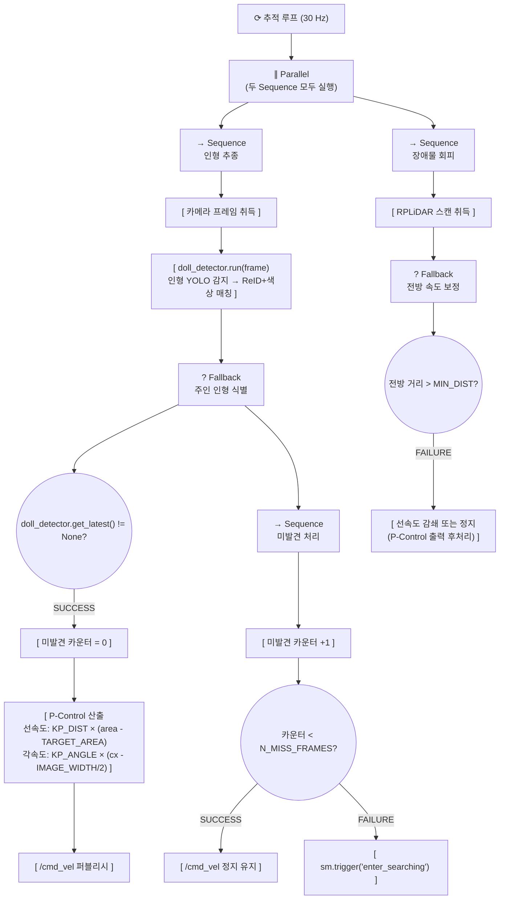
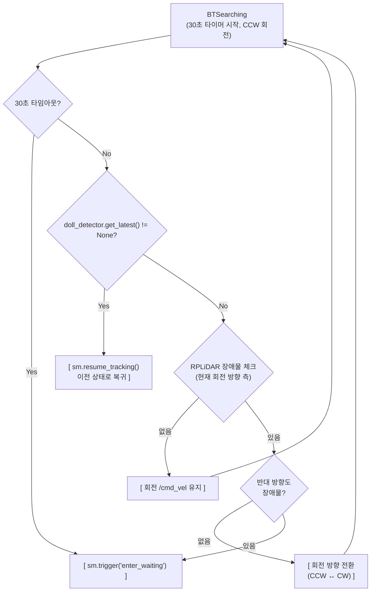
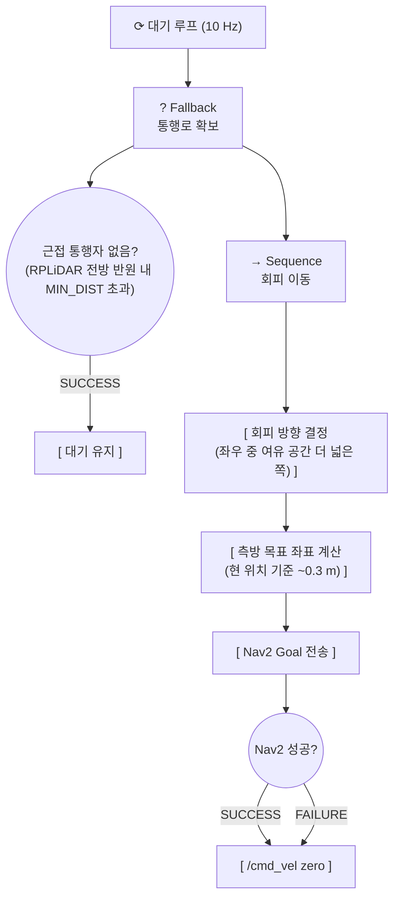
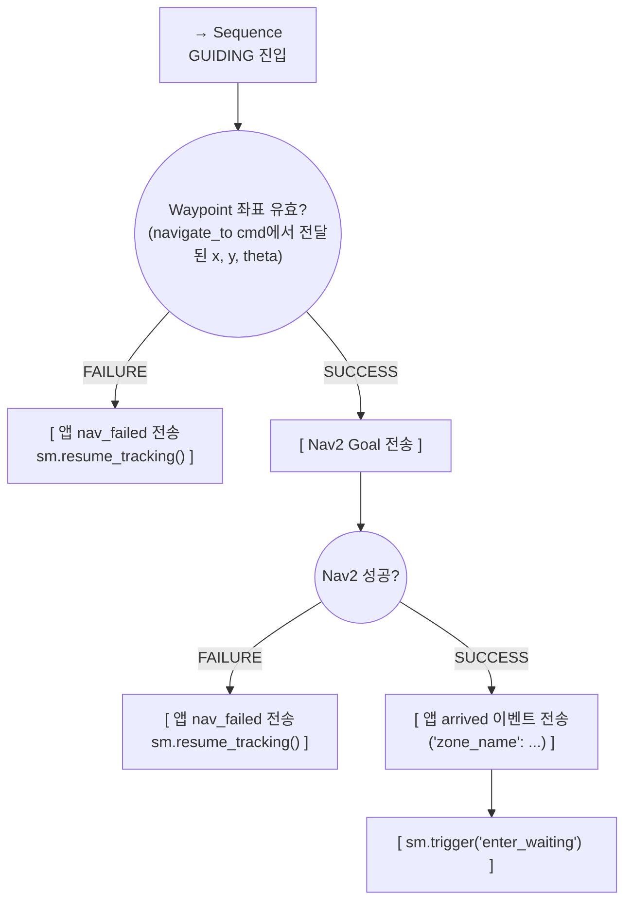
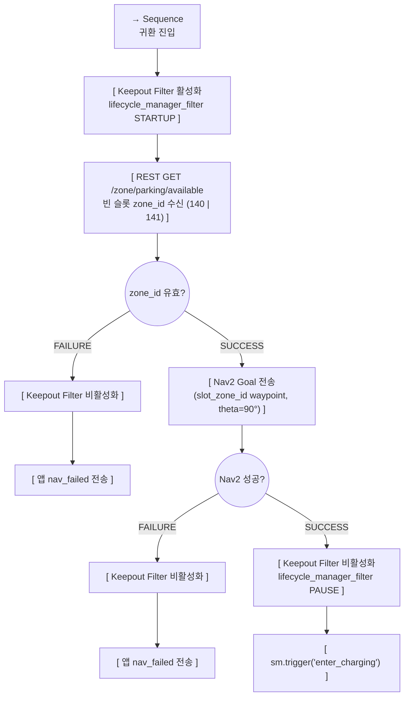

# 행동 트리 (Behavior Tree)

> **프로젝트:** 쑈삥끼 (ShopPinkki)
> **팀:** 삥끼랩 | 에드인에듀 자율주행 프로젝트 2팀

쑈삥끼의 **주행·네비게이션 세부 로직**을 Behavior Tree로 정의합니다.
상태 전환 판단은 State Machine(`docs/state_machine.md`)이 담당하며,
BT는 각 상태 안에서 **"어떻게 움직일 것인가"** 만 책임집니다.

---

## SM ↔ BT 역할 분담

```
State Machine              Behavior Tree
──────────────             ──────────────────────────────
어떤 상태인가?    ←──────→  그 상태에서 어떻게 움직이는가?
상태 전환 결정              주행·회피·탐색 세부 실행
이벤트 수신                 주행 완료/실패 → SM에 트리거 반환
```

- SM `on_enter_*` 콜백에서 해당 BT를 시작 (tick loop)
- SM `on_exit_*` 콜백에서 BT 중단
- BT Action 노드가 `sm.trigger('...')` 호출로 SM 전환을 유발

---

## BT 적용 범위

| 상태 | BT | 이유 |
|---|---|---|
| `CHARGING` | 없음 | 정지 상태 |
| `IDLE` | 없음 | 정지 상태. YOLO 등록 대기만 수행 |
| `TRACKING` | **BT 1** | P-Control 추종 + RPLiDAR 장애물 회피 (병렬) |
| `TRACKING_CHECKOUT` | **BT 1** (공유) | TRACKING과 동일한 주행 로직 |
| `SEARCHING` | **BT 2** | 제자리 회전 탐색 + 장애물 방향 전환 |
| `WAITING` | **BT 3** | 정지 대기 + 통행자 감지 시 소폭 회피 이동 |
| `GUIDING` | **BT 4** | Nav2 Waypoint 이동 + 성공/실패 처리 |
| `RETURNING` | **BT 5** | Keepout 활성화 → 빈 슬롯 조회 → Nav2 귀환 |
| `LOCKED` | **BT 5** (공유) | LOCKED 진입 즉시 BT 5 위임 (`is_locked_return=True` 상태) |
| `HALTED` | 없음 | 즉시 정지. 모터 0, Nav2 취소. 자동 전환 없음 |

---

## 노드 표기

| 표기 | 종류 | 동작 |
|---|---|---|
| `→ Sequence` | 시퀀스 | 자식을 순서대로 실행. 하나라도 FAILURE → 전체 FAILURE |
| `? Fallback` | 폴백 | 자식을 순서대로 실행. 하나라도 SUCCESS → 전체 SUCCESS |
| `∥ Parallel` | 병렬 | 자식을 동시에 실행. 정책에 따라 SUCCESS/FAILURE 결정 |
| `[ ]` | Action | 실제 동작 수행 |
| `(( ))` | Condition | 조건 검사만 수행, 사이드이펙트 없음 |

---

## BT 1: TRACKING / TRACKING_CHECKOUT

**목적:** 커스텀 YOLO + ReID로 주인 인형을 식별하고 P-Control로 추종. RPLiDAR 장애물 회피를 병렬 적용.
**연관 SR:** SR-40, SR-41, SR-22, SR-31



**설계 포인트:**
- `doll_detector.run(frame)` 파이프라인: ① YOLO "인형" 클래스 전체 감지 → ② 각 bbox에 ReID 특징 벡터 + HSV 색상 히스토그램으로 주인 인형 매칭 → ③ 최고 유사도 후보를 내부 버퍼에 저장.
- `N_MISS_FRAMES` 연속 미감지 시 occlusion이 아닌 진짜 소실로 판단 → `enter_searching`.
- 장애물 회피는 P-Control 출력을 후처리(감쇄)로 보정. `/cmd_vel`은 단일 퍼블리셔에서만 출력.
- TRACKING_CHECKOUT은 동일 BT를 재사용. SM 상태만 다를 뿐 주행 로직 차이 없음.
- P-Control 파라미터: `KP_ANGLE=0.002`, `KP_DIST=0.0001`, `TARGET_AREA=40000`, `LINEAR_X_MAX=0.3 m/s`, `ANGULAR_Z_MAX=1.0 rad/s`.

---

## BT 2: SEARCHING

**목적:** 제자리 회전으로 30초간 주인 인형 재탐색. 재발견 시 이전 추종 상태로 복귀, 타임아웃 또는 양방향 차단 시 WAITING 전환.
**연관 SR:** SR-42, SR-41



**설계 포인트:**
- 시간 기반 단순화: 각도 스텝 없이 `SEARCH_TIMEOUT=30.0`초 타임아웃.
- 회전하면서 동시에 감지 확인 (정지-감지 반복 없음).
- RPLiDAR 좌/우 호(±45°~135°) 기준으로 현재 회전 방향의 장애물 체크.
- 재발견 시 `sm.resume_tracking()` 호출 → `previous_tracking_state` 기반으로 TRACKING 또는 TRACKING_CHECKOUT 복귀.

---

## BT 3: WAITING

**목적:** 정지 대기 중 근접 통행자를 감지하면 Nav2로 소폭 측방 이동하여 통행로 확보.
**연관 SR:** SR-43



**설계 포인트:**
- WAITING BT는 자체적으로 SM 전환을 유발하지 않는다. 상태 종료는 앱 명령(`resume_tracking` / `return`) 또는 타임아웃(SM에서 처리)으로만 이루어진다.
- Nav2 실패 시 해당 틱을 FAILURE 처리하고 다음 틱에 재시도.

---

## BT 4: GUIDING

**목적:** control_service로부터 전달받은 zone_id의 Waypoint로 Nav2 이동. 도착 후 앱 알림 + WAITING 전환. 실패 시 앱 알림 + `resume_tracking()`.
**연관 SR:** SR-44, SR-72



**설계 포인트:**
- `navigate_to` cmd 수신 시 control_service가 DB에서 waypoint 좌표를 조회하여 Pi에 함께 전달 (SR-72). BT는 별도 REST 조회 없이 cmd 페이로드의 좌표를 직접 사용.
- Waypoint 좌표 미포함 또는 Nav2 실패 모두 `nav_failed`로 통일 처리.
- 도착 시 WAITING으로 전환. 사용자가 도착 팝업 [확인] 클릭 → `resume_tracking` cmd → SM `resume_tracking()` 호출.

---

## BT 5: RETURNING / LOCKED 자동 귀환

**목적:** Keepout Filter 활성화 → 빈 충전소 슬롯(140/141) 조회 → Nav2 이동 → Keepout Filter 비활성화. LOCKED 진입 시에도 동일 BT 실행 (`is_locked_return=True` 플래그 유지).
**연관 SR:** SR-44, SR-45, SR-35



**설계 포인트:**
- RETURNING과 LOCKED 자동 귀환 모두 동일 BT를 사용. LOCKED 진입 시 `on_enter_LOCKED` 콜백에서 `is_locked_return=True`를 설정한 후 BT를 시작.
- `/zone/parking/available`: control_service가 ROBOT 테이블에서 슬롯 140/141 주변에 이미 도착한 로봇이 있는지 확인하여 빈 슬롯 반환. 둘 다 사용 중이면 140 반환(대기).
- Nav2 실패 시 Keepout Filter를 반드시 비활성화 후 종료.
- GUIDING(BT 4)에는 Keepout Filter 적용하지 않음.

**Keepout Filter 활성화/비활성화 구현:**
```python
from nav2_msgs.srv import ManageLifecycleNodes

LIFECYCLE_MGR_SRV = '/lifecycle_manager_filter/manage_nodes'

def _set_keepout_filter(node, enable: bool) -> None:
    client = node.create_client(ManageLifecycleNodes, LIFECYCLE_MGR_SRV)
    if not client.wait_for_service(timeout_sec=2.0):
        node.get_logger().warn('lifecycle_manager_filter not available, skipping')
        return
    req = ManageLifecycleNodes.Request()
    req.command = (ManageLifecycleNodes.Request.STARTUP if enable
                   else ManageLifecycleNodes.Request.PAUSE)
    client.call_async(req)
```

---

## BT ↔ SM 트리거 요약

| BT | SM 트리거 | 전환 결과 |
|---|---|---|
| BT 1 (TRACKING) | `enter_searching` | TRACKING → SEARCHING |
| BT 2 (SEARCHING) | `sm.resume_tracking()` | SEARCHING → TRACKING 또는 TRACKING_CHECKOUT |
| BT 2 (SEARCHING) | `enter_waiting` | SEARCHING → WAITING (타임아웃 / 양방향 차단) |
| BT 3 (WAITING) | 없음 — SM 이벤트로만 종료 | — |
| BT 4 (GUIDING) | `enter_waiting` | GUIDING → WAITING (도착) |
| BT 4 (GUIDING) | `sm.resume_tracking()` | GUIDING → TRACKING 또는 TRACKING_CHECKOUT (실패) |
| BT 5 (RETURNING) | `enter_charging` | RETURNING → CHARGING (도착) |
| BT 5 (RETURNING) | (nav_failed 앱 알림만) | 실패 시 상태 유지 — 스태프 처리 필요 |
