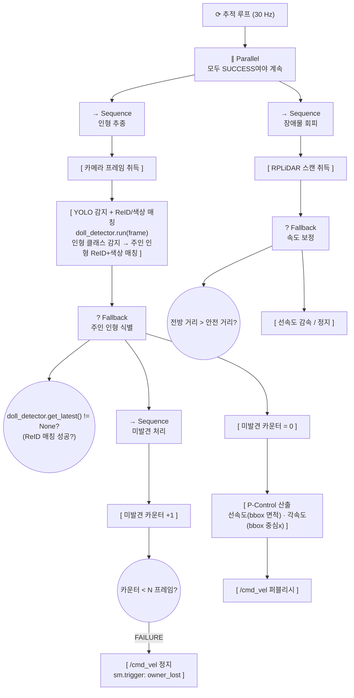
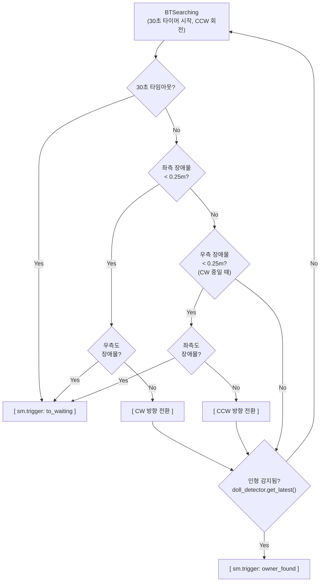
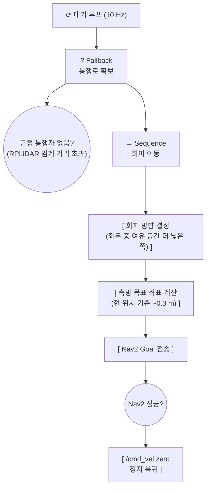
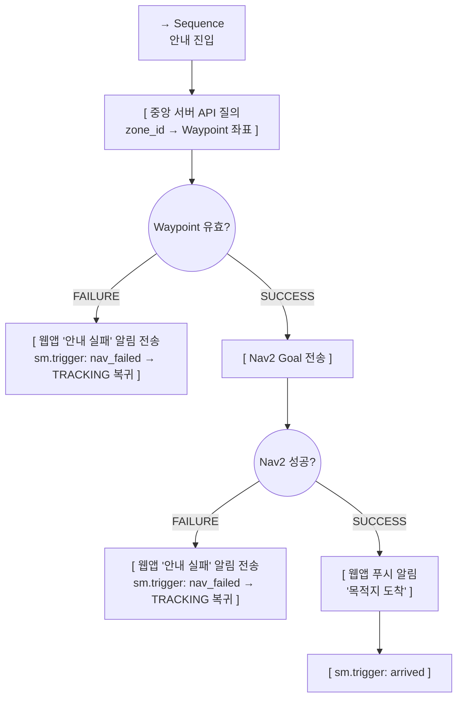
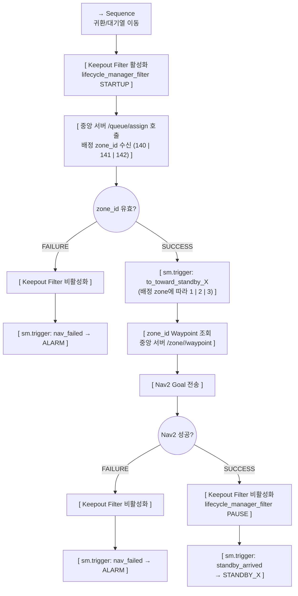

# 행동 트리 (Behavior Tree)

> **프로젝트:** 쑈삥끼 (ShopPinkki)
> **팀:** 삥끼랩 | 에드인에듀 자율주행 프로젝트 2팀

쑈삥끼의 **주행·네비게이션 세부 로직**을 Behavior Tree로 정의합니다.
상태 전환 판단은 State Machine(`docs/state_machine.md`)이 담당하며,
BT는 각 상태 안에서 "어떻게 움직일 것인가"만 책임집니다.

---

## SM ↔ BT 역할 분담

```
State Machine           Behavior Tree
──────────────          ──────────────────────────────
어떤 상태인가?    ←───→  그 상태에서 어떻게 움직이는가?
상태 전환 결정           주행·회피·탐색 세부 실행
이벤트 수신              주행 완료/실패 → SM에 이벤트 반환
```

- SM `on_enter_*` 콜백에서 해당 BT를 시작(tick loop)
- SM `on_exit_*` 콜백에서 BT 중단
- BT Action 노드가 `sm.trigger('event')` 호출로 전환을 유발

---

## BT 적용 범위

BT는 **주행·네비게이션 로직이 있는 상태**에만 적용합니다.

| 상태 | BT 적용 | 이유 |
|---|---|---|
| `BATTERY_CHECK` | 없음 | 정지 상태. 배터리 수준 확인만 수행 |
| `CHARGING` | 없음 | 충전 중 정지 상태 |
| `IDLE` | 없음 | 정지 상태. LCD QR 표시만 수행 |
| `REGISTERING` | 없음 | 정지 상태. 인형 등록 대기 |
| `TRACKING` | BT 1 | P-Control 추종 + 장애물 회피 |
| `SEARCHING` | BT 2 | 제자리 회전 탐색 |
| `WAITING` | BT 3 | 통행자 회피 이동 |
| `ITEM_ADDING` | 없음 | 정지 상태. QR 스캔만 수행 (주행 없음) |
| `GUIDING` | BT 4 | Nav2 Waypoint 이동 |
| `CHECK_OUT` | 없음 | 정지 상태. 결제 처리 중 UI 이벤트 대기 |
| `RETURNING` | BT 5 | QueueManager 배정 후 Nav2로 대기열 위치 이동 |
| `TOWARD_STANDBY_1/2/3` | BT 5 | 배정된 대기열 위치로 Nav2 이동 (queue_advance 수신 후) |
| `STANDBY_1/2/3` | 없음 | 대기열 위치 도착. 사용자 수령 또는 queue_advance 대기 |
| `ALARM` | 없음 | 이동 정지. 직원 호출 대기만 수행 |

---

## 노드 표기

| 표기 | 종류 | 동작 |
|---|---|---|
| `→ Sequence` | 시퀀스 | 자식을 순서대로 실행. 하나라도 FAILURE → FAILURE |
| `? Fallback` | 폴백 | 자식을 순서대로 실행. 하나라도 SUCCESS → SUCCESS |
| `[ ]` | Action | 실제 동작 수행 |
| `(( ))` | Condition | 조건 검사만 수행, 사이드이펙트 없음 |

---

## BT 1: TRACKING

**목적:** 커스텀 YOLO로 인형 클래스 감지 후 ReID+색상 매칭으로 주인 인형 식별, P-Control로 추종. RPLiDAR 장애물 회피를 병렬 적용.
**연관 SR:** SR-21, SR-22, SR-30, SR-31



**설계 포인트**
- `doll_detector.run(frame)` 내부 파이프라인: ① YOLO로 프레임 내 "인형" 클래스 모두 감지 → ② 각 bbox에 대해 ReID 특징 벡터 + 색상 히스토그램을 등록 템플릿과 비교 → ③ 임계값 이상 최고 유사도 후보를 주인 인형으로 선택.
- `get_latest()`는 매칭된 주인 인형의 `Detection`(cx, area, confidence, reid_score)을 반환. 매칭 실패 시 None.
- 미발견 카운터로 일시적 가림(occlusion)에 내성을 확보한다. N은 구현 시 확정.
- 장애물 회피는 P-Control 출력을 후처리로 보정하며, `/cmd_vel` 는 단일 퍼블리셔에서만 출력한다.

---

## BT 2: SEARCHING

**목적:** 30초간 제자리 회전하며 탐색. 재발견 시 TRACKING 복귀, 타임아웃/장애물 시 WAITING 전환.
**연관 SR:** SR-21, SR-22, SR-37



**설계 포인트**
- 스텝/각도 없이 시간 기반으로 단순화. `SEARCH_TIMEOUT = 30.0`초.
- 회전하면서 동시에 감지 확인 (정지-감지 반복 없음).
- RPLiDAR 좌/우 호(45°~135°, 225°~315°) 기준으로 장애물 체크.
- 장애물 감지 시 반대 방향으로 전환. 양측 모두 막히면 즉시 WAITING.

---

## BT 3: WAITING

**목적:** 정지 대기 중 근접 통행자를 감지하면 Nav2로 소폭 측방 이동하여 통행로를 확보한다.
**연관 SR:** SR-36



**설계 포인트**
- WAITING BT는 SM 이벤트(앱 명령, 타임아웃)로만 종료되며 자체적으로 상태 전환을 유발하지 않는다.
- Nav2 실패 시 해당 틱을 FAILURE 처리하고 다음 틱에 재시도한다.

---

## BT 4: GUIDING

**목적:** 중앙 서버에서 상품 구역 Waypoint를 조회하여 Nav2로 이동. 도착 후 앱 알림 전송 및 TRACKING 복귀.
**연관 SR:** SR-35, SR-80, SR-81b



**설계 포인트**
- SM은 앱으로부터 zone_id를 받아 GUIDING으로 진입한다. Waypoint 조회는 BT가 zone_id로 수행한다.
- Waypoint 조회 실패와 Nav2 실패 모두 `nav_failed`로 처리한다 → TRACKING 복귀 + 앱 알림.
- 구역 이탈 감지(ALARM 전환)는 BT가 아닌 SM의 `/amcl_pose` 구독 콜백에서 처리한다.

---

## BT 5: RETURNING / TOWARD_STANDBY

**목적:** RETURNING — QueueManager에서 배정된 대기열 위치(zone 140/141/142)로 Nav2 이동. 도착 후 STANDBY 대기 진입.
TOWARD_STANDBY — queue_advance 수신 후 앞 대기열 위치로 Nav2 재이동.
**연관 SR:** SR-35, SR-84, SR-17



**설계 포인트**
- RETURNING 진입 시 `/queue/assign?robot_id=<id>` 를 호출하여 배정된 zone_id(140/141/142)를 받는다.
- zone_id에 따라 `to_toward_standby_1/2/3` 트리거로 SM 전환 후 해당 zone으로 Nav2 이동.
- 도착 시 `standby_arrived` 트리거 → STANDBY_X 진입. 세션 종료는 STANDBY_1 → IDLE 전환 시(사용자 카트 수령) 수행.
- TOWARD_STANDBY 상태(queue_advance 후)에서도 동일 BT 재사용: 배정 대신 SM이 직접 목표 zone 전달.
- 구역 이탈 감지는 SM의 `/amcl_pose` 구독 콜백에서 처리한다 (BT와 독립).
- **Keepout Filter**: RETURNING/TOWARD_STANDBY 시작 시 활성화, 완료·실패 시 비활성화. BT4(GUIDING)에는 적용하지 않음.

**Keepout Filter 활성화/비활성화 구현 (BTReturning):**
```python
from nav2_msgs.srv import ManageLifecycleNodes

LIFECYCLE_MGR_SRV = '/lifecycle_manager_filter/manage_nodes'

def _set_keepout_filter(self, enable: bool) -> None:
    """RETURNING 시작 시 enable=True, 완료/실패 시 enable=False."""
    client = self._node.create_client(ManageLifecycleNodes, LIFECYCLE_MGR_SRV)
    if not client.wait_for_service(timeout_sec=2.0):
        self._node.get_logger().warn('lifecycle_manager_filter not available, skipping')
        return
    req = ManageLifecycleNodes.Request()
    req.command = (ManageLifecycleNodes.Request.STARTUP if enable
                   else ManageLifecycleNodes.Request.PAUSE)
    client.call_async(req)
```

---

## BT-SM 이벤트 인터페이스 요약

| BT | SM trigger | 전환 결과 |
|---|---|---|
| TRACKING BT | `owner_lost` | TRACKING → SEARCHING |
| SEARCHING BT | `owner_found` | SEARCHING → TRACKING |
| SEARCHING BT | `to_waiting` | SEARCHING → WAITING (타임아웃 또는 양측 장애물) |
| WAITING BT | (없음 — SM 이벤트로만 종료) | — |
| GUIDING BT | `arrived` | GUIDING → TRACKING |
| GUIDING BT | `nav_failed` | GUIDING → TRACKING (앱 "안내 실패" 알림) |
| RETURNING BT | `to_toward_standby_1/2/3` | RETURNING → TOWARD_STANDBY_X (QueueManager 배정) |
| RETURNING BT | `standby_arrived` | TOWARD_STANDBY_X → STANDBY_X (대기열 위치 도착) |
| RETURNING BT | `nav_failed` | RETURNING / TOWARD_STANDBY_X → ALARM (직원 개입 필요) |
