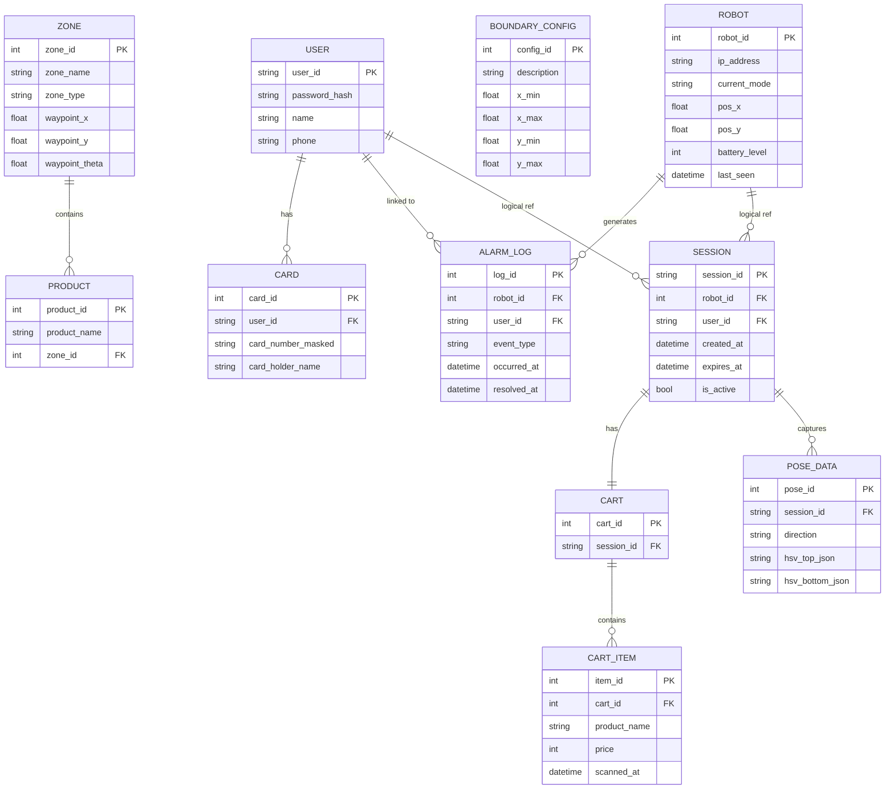

# ERD (Entity-Relationship Diagram)

> **프로젝트:** 쑈삥끼 (ShopPinkki)
> **팀:** 삥끼랩 | 에드인에듀 자율주행 프로젝트 2팀

---

## 저장 위치 구분

| 엔티티 | 저장 위치 | 근거 |
|---|---|---|
| USER | 중앙 서버 DB | SR-10 — Pi 5는 계정 DB 미보유 |
| CARD | 중앙 서버 DB | SR-10, SR-53 |
| ZONE | 중앙 서버 DB | SR-80 — 상품/특수 구역 Waypoint |
| PRODUCT | 중앙 서버 DB | SR-81 — 상품명→구역 매핑, 물건 찾기 질의 대상 |
| BOUNDARY_CONFIG | 중앙 서버 DB | SR-82, SR-83 — 도난/결제 구역 좌표 |
| ROBOT | 중앙 서버 DB | SR-61 — Pi 5가 WebSocket으로 상태 보고 |
| ALARM_LOG | 중앙 서버 DB | SR-63 — 이벤트 발생 시 즉시 전송 |
| SESSION | Pi 5 로컬 | SR-18 — 활성 세션 여부를 Pi 5가 관리 |
| POSE_DATA | Pi 5 로컬 | SR-17 — 세션 종료 시 삭제 |
| CART | Pi 5 로컬 | SR-42 — Flask 웹앱에서 관리 |
| CART_ITEM | Pi 5 로컬 | SR-41, SR-42 |

---

## ERD

---

## 엔티티 상세

### 중앙 서버 DB

#### USER
사용자 계정 정보. 어느 쑈삥끼에서든 동일 계정으로 이용 가능 (UR-02).

| 컬럼 | 타입 | 설명 |
|---|---|---|
| user_id | STRING | 로그인 ID (PK) |
| password_hash | STRING | 해시 처리된 비밀번호 |
| name | STRING | 이름 |
| phone | STRING | 전화번호 |

#### CARD
결제용 카드 정보. 최초 회원가입 시 등록 (SR-53). 데모용 가상 결제에 사용.

| 컬럼 | 타입 | 설명 |
|---|---|---|
| card_id | INT | PK |
| user_id | STRING | FK → USER |
| card_number_masked | STRING | 마스킹된 카드번호 |
| card_holder_name | STRING | 카드 명의자 |

#### ZONE
상품 구역(ID 1~8) 및 특수 구역(ID 100~)의 Nav2 Waypoint 좌표 (SR-80).

| 컬럼 | 타입 | 설명 |
|---|---|---|
| zone_id | INT | PK (1~8: 상품, 100~: 특수) |
| zone_name | STRING | 구역명 (예: 과자, 결제 구역) |
| zone_type | STRING | `product` / `special` |
| waypoint_x | FLOAT | Nav2 목표 좌표 x |
| waypoint_y | FLOAT | Nav2 목표 좌표 y |
| waypoint_theta | FLOAT | Nav2 목표 방향 (rad) |

#### PRODUCT
상품명과 진열 구역의 매핑 테이블. Pi 5가 물건 찾기 요청 시 중앙 서버에 상품명으로 질의하면 해당 ZONE의 Waypoint를 응답받는다 (SR-81, UR-15).

| 컬럼 | 타입 | 설명 |
|---|---|---|
| product_id | INT | PK |
| product_name | STRING | 상품명 (예: 콜라, 삼겹살) |
| zone_id | INT | FK → ZONE |

> **운영 규칙:** `zone_id`는 반드시 `zone_type = 'product'`인 구역(ID 1~8)만 참조해야 한다. 특수 구역(ID 100~)에 상품을 매핑하지 않는다.

#### BOUNDARY_CONFIG
도난 감지용 맵 외곽 경계 좌표 및 결제 구역 진입 좌표 임계값 (SR-82, SR-83).

| 컬럼 | 타입 | 설명 |
|---|---|---|
| config_id | INT | PK |
| description | STRING | 예: `shop_boundary`, `payment_zone` |
| x_min | FLOAT | x 최솟값 |
| x_max | FLOAT | x 최댓값 |
| y_min | FLOAT | y 최솟값 |
| y_max | FLOAT | y 최댓값 |

#### ROBOT
각 Pi 5 로봇의 식별 정보 및 실시간 상태. Pi 5가 WebSocket으로 1~2Hz 주기 갱신 (SR-61).

| 컬럼 | 타입 | 설명 |
|---|---|---|
| robot_id | INT | PK (예: 54, 18) |
| ip_address | STRING | 예: `192.168.x.54` |
| current_mode | STRING | 현재 동작 모드 |
| pos_x | FLOAT | AMCL 기반 현재 위치 x |
| pos_y | FLOAT | AMCL 기반 현재 위치 y |
| battery_level | INT | 배터리 잔량 (%, 0~100) |
| last_seen | DATETIME | 마지막 WebSocket 수신 시각 |

#### ALARM_LOG
직원 호출 이벤트 로그. 장시간 대기 / 도난 / 배터리 부족 / 결제 오류 (SR-63).

| 컬럼 | 타입 | 설명 |
|---|---|---|
| log_id | INT | PK |
| robot_id | INT | FK → ROBOT |
| user_id | STRING | FK → USER (알람 발생 시점의 세션 사용자, null 가능) |
| event_type | STRING | `TIMEOUT` / `THEFT` / `BATTERY` / `PAYMENT_ERROR` |
| occurred_at | DATETIME | 이벤트 발생 시각 |
| resolved_at | DATETIME | 처리 완료 시각 (null = 미처리) |

---

### Pi 5 로컬 DB

#### SESSION
Pi 5가 관리하는 활성 세션. 세션 쿠키 유효성 및 사용 중 차단 판단에 사용 (SR-15, SR-18).

| 컬럼 | 타입 | 설명 |
|---|---|---|
| session_id | STRING | PK (쿠키 토큰) |
| robot_id | INT | 이 Pi 5의 robot_id |
| user_id | STRING | FK → 중앙 서버 USER |
| created_at | DATETIME | 세션 시작 시각 |
| expires_at | DATETIME | 세션 만료 시각 (현재 시각 초과 시 SR-16 플로우) |
| is_active | BOOL | 활성 여부 (보내주기로 명시 종료 시 false) |

#### POSE_DATA
포즈 스캔 결과. 전면/우측/후면/좌측 4방향 HSV 특징 저장. 세션 종료 시 전체 삭제 (SR-13, SR-17).

| 컬럼 | 타입 | 설명 |
|---|---|---|
| pose_id | INT | PK |
| session_id | STRING | FK → SESSION |
| direction | STRING | `front` / `right` / `back` / `left` |
| hsv_top_json | STRING | 상체 HSV 히스토그램 (16×16 bins, JSON) |
| hsv_bottom_json | STRING | 하체 HSV 히스토그램 (16×16 bins, JSON) |

#### CART
세션당 하나의 장바구니. 세션과 1:1 관계 (UR-12, UR-13).

| 컬럼 | 타입 | 설명 |
|---|---|---|
| cart_id | INT | PK |
| session_id | STRING | FK → SESSION |

#### CART_ITEM
장바구니에 담긴 상품. 상품 QR 코드 스캔으로 추가, 웹앱 삭제 버튼으로 제거 (SR-41, SR-42).

> **운영 규칙:** `product_name`은 QR 코드 인코딩 시 중앙 서버 PRODUCT 테이블의 `product_name`과 반드시 일치해야 한다. 불일치 시 물건 찾기 기능이 정상 동작하지 않을 수 있다.

| 컬럼 | 타입 | 설명 |
|---|---|---|
| item_id | INT | PK |
| cart_id | INT | FK → CART |
| product_name | STRING | 상품명 (QR 디코딩) |
| price | INT | 가격 (원, QR 디코딩) |
| scanned_at | DATETIME | 스캔 시각 |
