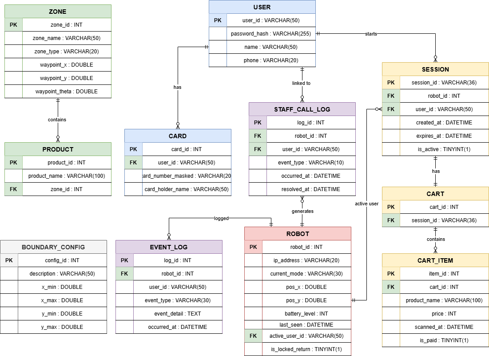

# ERD (Entity-Relationship Diagram)

> **프로젝트:** 쑈삥끼 (ShopPinkki)
> **팀:** 삥끼랩 | 에드인에듀 자율주행 프로젝트 2팀
> **DB:** MySQL (control_service가 TCP:3306으로 접근. 채널 E)

---

## 저장 위치

> Pi 5 로컬 DB 없음. 모든 테이블이 중앙 서버 MySQL DB에 통합.

| 엔티티 | 근거 |
|---|---|
| USER | SR-10 — Pi 5는 계정 DB 미보유 |
| CARD | SR-10, UR-41 — 가상 결제용 카드 정보 |
| ZONE | SR-70 — 상품/특수 구역 Nav2 Waypoint |
| PRODUCT | SR-70 — 상품명 → 구역 매핑 |
| BOUNDARY_CONFIG | SR-73 — 결제 구역 좌표 임계값 |
| ROBOT | SR-91 — Pi 5가 채널 G `/robot_<id>/status`로 상태 보고 |
| STAFF_CALL_LOG | SR-93, UR-51 — LOCKED / HALTED 직원 호출 이벤트 |
| EVENT_LOG | UR-51 — 운용 이벤트 전체 타임라인 |
| SESSION | SR-13 — 세션 생성/종료 |
| CART | UR-30 — 세션당 1개 장바구니 |
| CART_ITEM | UR-30, SR-32b — QR 스캔 상품. `is_paid`로 결제 완료 항목 구분 |

---

## ERD



---

## MySQL DDL

```sql
CREATE DATABASE IF NOT EXISTS shoppinkki CHARACTER SET utf8mb4 COLLATE utf8mb4_unicode_ci;
USE shoppinkki;

CREATE TABLE user (
    user_id       VARCHAR(50)  PRIMARY KEY,
    password_hash VARCHAR(255) NOT NULL,
    name          VARCHAR(50),
    phone         VARCHAR(20)
);

CREATE TABLE card (
    card_id            INT AUTO_INCREMENT PRIMARY KEY,
    user_id            VARCHAR(50)  NOT NULL,
    card_number_masked VARCHAR(20),
    card_holder_name   VARCHAR(50),
    FOREIGN KEY (user_id) REFERENCES user(user_id)
);

CREATE TABLE zone (
    zone_id        INT PRIMARY KEY,
    zone_name      VARCHAR(50)  NOT NULL,
    zone_type      VARCHAR(20)  NOT NULL,   -- 'product' | 'special'
    waypoint_x     DOUBLE,
    waypoint_y     DOUBLE,
    waypoint_theta DOUBLE
);

CREATE TABLE product (
    product_id   INT AUTO_INCREMENT PRIMARY KEY,
    product_name VARCHAR(100) NOT NULL,
    zone_id      INT          NOT NULL,
    FOREIGN KEY (zone_id) REFERENCES zone(zone_id)
);

CREATE TABLE boundary_config (
    config_id   INT AUTO_INCREMENT PRIMARY KEY,
    description VARCHAR(50)  NOT NULL,   -- 'shop_boundary' | 'payment_zone'
    x_min       DOUBLE,
    x_max       DOUBLE,
    y_min       DOUBLE,
    y_max       DOUBLE
);

CREATE TABLE robot (
    robot_id        INT         PRIMARY KEY,   -- 예: 54, 18
    ip_address      VARCHAR(20),               -- 예: 192.168.102.54
    current_mode    VARCHAR(30),               -- 10개 상태 중 하나 또는 'OFFLINE'
    pos_x           DOUBLE,
    pos_y           DOUBLE,
    battery_level   INT,
    last_seen       DATETIME,
    active_user_id  VARCHAR(50),
    is_locked_return TINYINT(1) NOT NULL DEFAULT 0,
    FOREIGN KEY (active_user_id) REFERENCES user(user_id),
    UNIQUE KEY uk_active_user (active_user_id)   -- 유저 1명 = 로봇 1대
);

CREATE TABLE staff_call_log (
    log_id      INT AUTO_INCREMENT PRIMARY KEY,
    robot_id    INT         NOT NULL,
    user_id     VARCHAR(50),
    event_type  VARCHAR(10) NOT NULL,   -- 'LOCKED' | 'HALTED'
    occurred_at DATETIME    NOT NULL DEFAULT CURRENT_TIMESTAMP,
    resolved_at DATETIME,               -- NULL = 미처리
    FOREIGN KEY (robot_id) REFERENCES robot(robot_id),
    FOREIGN KEY (user_id)  REFERENCES user(user_id)
);

CREATE TABLE event_log (
    log_id       INT AUTO_INCREMENT PRIMARY KEY,
    robot_id     INT,
    user_id      VARCHAR(50),
    event_type   VARCHAR(30) NOT NULL,
    event_detail TEXT,                  -- JSON 문자열
    occurred_at  DATETIME    NOT NULL DEFAULT CURRENT_TIMESTAMP,
    FOREIGN KEY (robot_id) REFERENCES robot(robot_id)
);

CREATE INDEX idx_event_log_robot ON event_log(robot_id, occurred_at DESC);
CREATE INDEX idx_event_log_type  ON event_log(event_type, occurred_at DESC);

CREATE TABLE session (
    session_id      VARCHAR(36) PRIMARY KEY,   -- UUID
    robot_id        INT         NOT NULL,
    user_id         VARCHAR(50) NOT NULL,
    created_at      DATETIME    NOT NULL DEFAULT CURRENT_TIMESTAMP,
    expires_at      DATETIME    NOT NULL,
    is_active       TINYINT(1)  NOT NULL DEFAULT 1,
    active_user_key  VARCHAR(50) GENERATED ALWAYS AS (IF(is_active = 1, user_id, NULL)) VIRTUAL,
    active_robot_key INT         GENERATED ALWAYS AS (IF(is_active = 1, robot_id, NULL)) VIRTUAL,
    FOREIGN KEY (robot_id) REFERENCES robot(robot_id),
    FOREIGN KEY (user_id)  REFERENCES user(user_id),
    UNIQUE KEY uk_active_session_user  (active_user_key),    -- 활성 세션 중 유저 1명 = 세션 1개
    UNIQUE KEY uk_active_session_robot (active_robot_key)    -- 활성 세션 중 로봇 1대 = 세션 1개
);

CREATE TABLE cart (
    cart_id    INT AUTO_INCREMENT PRIMARY KEY,
    session_id VARCHAR(36) NOT NULL UNIQUE,
    FOREIGN KEY (session_id) REFERENCES session(session_id)
);

CREATE TABLE cart_item (
    item_id      INT AUTO_INCREMENT PRIMARY KEY,
    cart_id      INT          NOT NULL,
    product_name VARCHAR(100) NOT NULL,
    price        INT          NOT NULL,
    scanned_at   DATETIME     NOT NULL DEFAULT CURRENT_TIMESTAMP,
    is_paid      TINYINT(1)   NOT NULL DEFAULT 0,
    FOREIGN KEY (cart_id) REFERENCES cart(cart_id)
);
```

---

## MySQL 연결 설정

```python
# control_service/db.py
import os
import mysql.connector
from mysql.connector import pooling

DB_CONFIG = {
    'host':     os.environ.get('MYSQL_HOST', 'localhost'),
    'port':     int(os.environ.get('MYSQL_PORT', 3306)),
    'user':     os.environ.get('MYSQL_USER', 'shoppinkki'),
    'password': os.environ.get('MYSQL_PASSWORD', ''),
    'database': os.environ.get('MYSQL_DATABASE', 'shoppinkki'),
}

pool = pooling.MySQLConnectionPool(pool_name='shoppinkki', pool_size=5, **DB_CONFIG)

def get_conn():
    return pool.get_connection()
```

사용 패턴:
```python
# 조회
with get_conn() as conn:
    cursor = conn.cursor(dictionary=True)
    cursor.execute("SELECT * FROM robot WHERE robot_id = %s", (robot_id,))
    row = cursor.fetchone()

# 쓰기
with get_conn() as conn:
    cursor = conn.cursor()
    cursor.execute("UPDATE robot SET current_mode=%s WHERE robot_id=%s", (mode, robot_id))
    conn.commit()
```

---

## 엔티티 상세

### USER
사용자 계정 정보. 어느 쑈삥끼에서든 동일 계정으로 이용 가능 (UR-02).

| 컬럼 | MySQL 타입 | 설명 |
|---|---|---|
| user_id | VARCHAR(50) PK | 로그인 ID |
| password_hash | VARCHAR(255) | 해시 처리된 비밀번호 |
| name | VARCHAR(50) | 이름 |
| phone | VARCHAR(20) | 전화번호 |

### CARD
결제용 카드 정보. 데모용 가상 결제에 사용 (UR-41, SR-84).

| 컬럼 | MySQL 타입 | 설명 |
|---|---|---|
| card_id | INT AUTO_INCREMENT PK | |
| user_id | VARCHAR(50) FK | → USER |
| card_number_masked | VARCHAR(20) | 마스킹된 카드번호 |
| card_holder_name | VARCHAR(50) | 카드 명의자 |

### ZONE
상품 구역(ID 1~8) 및 특수 구역(ID 100~)의 Nav2 Waypoint 좌표 (SR-70).

| 컬럼 | MySQL 타입 | 설명 |
|---|---|---|
| zone_id | INT PK | 1~8: 상품 구역. 100~: 특수 구역 |
| zone_name | VARCHAR(50) | 구역명 |
| zone_type | VARCHAR(20) | `product` / `special` |
| waypoint_x | DOUBLE | Nav2 목표 x (미터) |
| waypoint_y | DOUBLE | Nav2 목표 y (미터) |
| waypoint_theta | DOUBLE | Nav2 목표 방향 (rad) |

**특수 구역 주요 ID:**

| ID | 구역명 | 용도 |
|---|---|---|
| 110 | 입구 | 로봇 초기 진입 |
| 120 | 출구 | TRACKING 차단 기준 |
| 130 | 카트 충전소 | 귀환 목적지 (RETURNING / LOCKED) |
| 140 | 충전소 슬롯 1 | 병렬 주차 슬롯 1 (theta=90°) |
| 141 | 충전소 슬롯 2 | 병렬 주차 슬롯 2 (theta=90°) |
| 150 | 결제 구역 | BoundaryMonitor 결제 트리거 |

### PRODUCT
상품명 → 구역 매핑. 물건 찾기 안내에 사용 (SR-70, UR-32).

| 컬럼 | MySQL 타입 | 설명 |
|---|---|---|
| product_id | INT AUTO_INCREMENT PK | |
| product_name | VARCHAR(100) | 상품명 (예: 콜라) |
| zone_id | INT FK | → ZONE (`zone_type='product'`만 허용, ID 1~8) |

### BOUNDARY_CONFIG
결제 구역 진입 좌표 임계값 및 맵 외곽 경계 (SR-73).

| 컬럼 | MySQL 타입 | 설명 |
|---|---|---|
| config_id | INT AUTO_INCREMENT PK | |
| description | VARCHAR(50) | `shop_boundary` / `payment_zone` |
| x_min | DOUBLE | |
| x_max | DOUBLE | |
| y_min | DOUBLE | |
| y_max | DOUBLE | |

### ROBOT
각 Pi 5 로봇의 식별 정보 및 실시간 상태. `/robot_<id>/status`로 1~2Hz 갱신 (SR-91).

| 컬럼 | MySQL 타입 | 설명 |
|---|---|---|
| robot_id | INT PK | 54 / 18 |
| ip_address | VARCHAR(20) | `192.168.102.54` / `192.168.102.18` |
| current_mode | VARCHAR(30) | 10개 상태 중 하나 또는 `OFFLINE` |
| pos_x | DOUBLE | AMCL 기반 현재 위치 x (m) |
| pos_y | DOUBLE | AMCL 기반 현재 위치 y (m) |
| battery_level | INT | 배터리 잔량 (%, 0~100) |
| last_seen | DATETIME | 마지막 status 수신 시각 |
| active_user_id | VARCHAR(50) FK UNIQUE | 활성 세션 user_id. NULL=빈 카트. UNIQUE → 유저 1명=로봇 1대 강제 |
| is_locked_return | TINYINT(1) | LOCKED 귀환 중 LED 잠금 신호 플래그 (SR-55, UR-60) |

> **OFFLINE 판정:** cleanup 스레드(10초 주기)가 `last_seen < NOW() - 30s` 이면 `current_mode='OFFLINE'`, `active_user_id=NULL` 처리.
> **current_mode 값:** `CHARGING` / `IDLE` / `TRACKING` / `TRACKING_CHECKOUT` / `GUIDING` / `SEARCHING` / `WAITING` / `LOCKED` / `RETURNING` / `HALTED` / `OFFLINE`

### STAFF_CALL_LOG
LOCKED / HALTED 이벤트 발생 시 생성. `resolved_at=NULL`이면 미처리 (UR-51, UR-53).

| 컬럼 | MySQL 타입 | 설명 |
|---|---|---|
| log_id | INT AUTO_INCREMENT PK | |
| robot_id | INT FK | → ROBOT |
| user_id | VARCHAR(50) FK | → USER (NULL 가능 — HALTED 시 사용자 특정 불필요) |
| event_type | VARCHAR(10) | `LOCKED` / `HALTED` |
| occurred_at | DATETIME DEFAULT CURRENT_TIMESTAMP | |
| resolved_at | DATETIME | NULL = 미처리. `staff_resolved` 수신 시 설정 |

### EVENT_LOG
로봇 운용 이벤트 전체 타임라인 (UR-51).

| 컬럼 | MySQL 타입 | 설명 |
|---|---|---|
| log_id | INT AUTO_INCREMENT PK | |
| robot_id | INT FK | → ROBOT |
| user_id | VARCHAR(50) | NULL 가능 |
| event_type | VARCHAR(30) | 아래 표 참고 |
| event_detail | TEXT | JSON 문자열 (부가 정보) |
| occurred_at | DATETIME DEFAULT CURRENT_TIMESTAMP | |

**event_type 값:**

| event_type | 발생 시점 |
|---|---|
| `SESSION_START` | 로그인 완료 → IDLE 진입 |
| `SESSION_END` | 정상 귀환 충전소 도착 또는 staff_resolved |
| `FORCE_TERMINATE` | 관제 강제 종료 |
| `LOCKED` | LOCKED 상태 진입 |
| `HALTED` | HALTED 상태 진입 |
| `STAFF_RESOLVED` | staff_resolved 처리 완료 |
| `PAYMENT_SUCCESS` | 결제 완료 → TRACKING_CHECKOUT 전환 |
| `MODE_CHANGE` | SM 상태 전환 (선택적 기록) |
| `OFFLINE` | cleanup 스레드 OFFLINE 판정 |
| `ONLINE` | OFFLINE → 상태 수신 복귀 |

### SESSION
활성 세션 정보 (SR-11, SR-13).

| 컬럼 | MySQL 타입 | 설명 |
|---|---|---|
| session_id | VARCHAR(36) PK | UUID |
| robot_id | INT FK | → ROBOT |
| user_id | VARCHAR(50) FK | → USER |
| created_at | DATETIME DEFAULT CURRENT_TIMESTAMP | |
| expires_at | DATETIME | 자동 만료 시각 |
| is_active | TINYINT(1) DEFAULT 1 | 명시적 종료 플래그 |
| active_user_key | VARCHAR(50) VIRTUAL | `is_active=1`이면 `user_id`, 아니면 NULL. UNIQUE → 활성 세션 중 유저 1명=1세션 강제 |
| active_robot_key | INT VIRTUAL | `is_active=1`이면 `robot_id`, 아니면 NULL. UNIQUE → 활성 세션 중 로봇 1대=1세션 강제 |

> **유효 세션 판단:** `is_active = 1 AND expires_at > NOW()`

### CART
세션당 1개 장바구니 (UR-30).

| 컬럼 | MySQL 타입 | 설명 |
|---|---|---|
| cart_id | INT AUTO_INCREMENT PK | |
| session_id | VARCHAR(36) FK UNIQUE | → SESSION |

### CART_ITEM
장바구니에 담긴 상품 (UR-30, UR-40b, SR-32b).

| 컬럼 | MySQL 타입 | 설명 |
|---|---|---|
| item_id | INT AUTO_INCREMENT PK | |
| cart_id | INT FK | → CART |
| product_name | VARCHAR(100) | QR 디코딩 상품명 |
| price | INT | 가격 (원, QR 디코딩) |
| scanned_at | DATETIME DEFAULT CURRENT_TIMESTAMP | |
| is_paid | TINYINT(1) DEFAULT 0 | 결제 완료 여부. `payment_success` 수신 시 미결제 전체 → 1 |

> **is_paid 운영 규칙:** 결제 팝업에서 결제 완료(payment_success) 시 현재 `is_paid=0`인 항목 전체를 `is_paid=1`로 갱신. 이후 TRACKING_CHECKOUT → TRACKING 전환(쇼핑 재개) 후 새로 추가된 항목은 `is_paid=0`으로 시작. 다음 결제 구역 진입 시 `is_paid=0` 항목만 결제 대상.
> **미결제 판단 (보내주기/LOCKED 조건):** `SELECT COUNT(*) FROM cart_item WHERE cart_id=? AND is_paid=0` > 0
