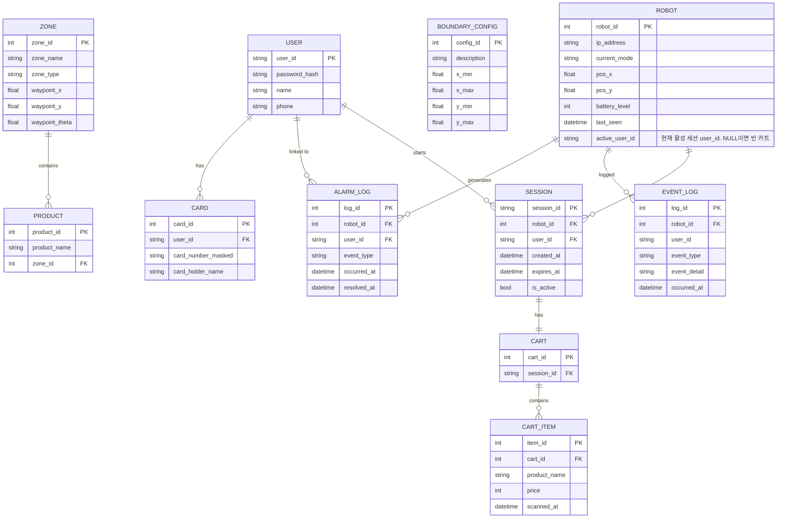

# ERD (Entity-Relationship Diagram)

> **프로젝트:** 쑈삥끼 (ShopPinkki)
> **팀:** 삥끼랩 | 에드인에듀 자율주행 프로젝트 2팀
> **DB:** MySQL (control_service가 TCP:3306으로 접근. 채널 E)

---

## 저장 위치 구분

> Pi 5 로컬 DB 없음. SESSION / CART / CART_ITEM 모두 중앙 서버 DB로 통합.
> POSE_DATA 제거 — 커스텀 YOLO 인형 추적으로 전환하여 포즈 스캔 불필요.

| 엔티티 | 저장 위치 | 근거 |
|---|---|---|
| USER | 중앙 MySQL DB | SR-10 — Pi 5는 계정 DB 미보유 |
| CARD | 중앙 MySQL DB | SR-10, SR-53 |
| ZONE | 중앙 MySQL DB | SR-80 — 상품/특수 구역 Waypoint |
| PRODUCT | 중앙 MySQL DB | SR-81 — 상품명→구역 매핑 |
| BOUNDARY_CONFIG | 중앙 MySQL DB | SR-82, SR-83 — 도난/결제 구역 좌표 |
| ROBOT | 중앙 MySQL DB | SR-61 — Pi 5가 채널 G `/robot_<id>/status`로 상태 보고 |
| ALARM_LOG | 중앙 MySQL DB | SR-63 — 이벤트 발생 시 즉시 전송 |
| EVENT_LOG | 중앙 MySQL DB | scenario_17 — 운용 이벤트 타임라인 |
| SESSION | 중앙 MySQL DB | Pi 로컬 DB 제거 → Control Service REST API로 관리 |
| CART | 중앙 MySQL DB | Pi 로컬 DB 제거 → Control Service REST API로 관리 |
| CART_ITEM | 중앙 MySQL DB | Pi 로컬 DB 제거 → Control Service REST API로 관리 |

---

## ERD



---

## MySQL DDL

```sql
CREATE DATABASE IF NOT EXISTS shoppinkki CHARACTER SET utf8mb4 COLLATE utf8mb4_unicode_ci;
USE shoppinkki;

CREATE TABLE user (
    user_id       VARCHAR(50)  PRIMARY KEY,
    password_hash VARCHAR(255) NOT NULL,
    name          VARCHAR(50),
    phone         VARCHAR(20)
);

CREATE TABLE card (
    card_id            INT AUTO_INCREMENT PRIMARY KEY,
    user_id            VARCHAR(50)  NOT NULL,
    card_number_masked VARCHAR(20),
    card_holder_name   VARCHAR(50),
    FOREIGN KEY (user_id) REFERENCES user(user_id)
);

CREATE TABLE zone (
    zone_id        INT PRIMARY KEY,
    zone_name      VARCHAR(50)  NOT NULL,
    zone_type      VARCHAR(20)  NOT NULL,   -- 'product' | 'special'
    waypoint_x     DOUBLE,
    waypoint_y     DOUBLE,
    waypoint_theta DOUBLE
);

CREATE TABLE product (
    product_id   INT AUTO_INCREMENT PRIMARY KEY,
    product_name VARCHAR(100) NOT NULL,
    zone_id      INT          NOT NULL,
    FOREIGN KEY (zone_id) REFERENCES zone(zone_id)
);

CREATE TABLE boundary_config (
    config_id   INT AUTO_INCREMENT PRIMARY KEY,
    description VARCHAR(50)  NOT NULL,   -- 'shop_boundary' | 'payment_zone'
    x_min       DOUBLE,
    x_max       DOUBLE,
    y_min       DOUBLE,
    y_max       DOUBLE
);

CREATE TABLE robot (
    robot_id       INT         PRIMARY KEY,
    ip_address     VARCHAR(20),
    current_mode   VARCHAR(30),
    pos_x          DOUBLE,
    pos_y          DOUBLE,
    battery_level  INT,
    last_seen      DATETIME,
    active_user_id VARCHAR(50),
    FOREIGN KEY (active_user_id) REFERENCES user(user_id)
);

CREATE TABLE alarm_log (
    log_id      INT AUTO_INCREMENT PRIMARY KEY,
    robot_id    INT,
    user_id     VARCHAR(50),
    event_type  VARCHAR(20) NOT NULL,   -- 'THEFT'|'BATTERY_LOW'|'TIMEOUT'|'PAYMENT_ERROR'
    occurred_at DATETIME    NOT NULL DEFAULT CURRENT_TIMESTAMP,
    resolved_at DATETIME,
    FOREIGN KEY (robot_id) REFERENCES robot(robot_id),
    FOREIGN KEY (user_id)  REFERENCES user(user_id)
);

CREATE TABLE event_log (
    log_id       INT AUTO_INCREMENT PRIMARY KEY,
    robot_id     INT,
    user_id      VARCHAR(50),
    event_type   VARCHAR(30) NOT NULL,
    event_detail TEXT,                  -- JSON 문자열
    occurred_at  DATETIME    NOT NULL DEFAULT CURRENT_TIMESTAMP,
    FOREIGN KEY (robot_id) REFERENCES robot(robot_id)
);

CREATE INDEX idx_event_log_robot ON event_log(robot_id, occurred_at DESC);
CREATE INDEX idx_event_log_type  ON event_log(event_type, occurred_at DESC);

CREATE TABLE session (
    session_id VARCHAR(36) PRIMARY KEY,   -- UUID
    robot_id   INT         NOT NULL,
    user_id    VARCHAR(50) NOT NULL,
    created_at DATETIME    NOT NULL DEFAULT CURRENT_TIMESTAMP,
    expires_at DATETIME    NOT NULL,
    is_active  TINYINT(1)  NOT NULL DEFAULT 1,
    FOREIGN KEY (robot_id) REFERENCES robot(robot_id),
    FOREIGN KEY (user_id)  REFERENCES user(user_id)
);

CREATE TABLE cart (
    cart_id    INT AUTO_INCREMENT PRIMARY KEY,
    session_id VARCHAR(36) NOT NULL UNIQUE,
    FOREIGN KEY (session_id) REFERENCES session(session_id)
);

CREATE TABLE cart_item (
    item_id      INT AUTO_INCREMENT PRIMARY KEY,
    cart_id      INT         NOT NULL,
    product_name VARCHAR(100) NOT NULL,
    price        INT         NOT NULL,
    scanned_at   DATETIME    NOT NULL DEFAULT CURRENT_TIMESTAMP,
    FOREIGN KEY (cart_id) REFERENCES cart(cart_id)
);
```

---

## MySQL 연결 설정

```python
# control_service/db.py
import mysql.connector
from mysql.connector import pooling

DB_CONFIG = {
    'host':     os.environ.get('MYSQL_HOST', 'localhost'),
    'port':     int(os.environ.get('MYSQL_PORT', 3306)),
    'user':     os.environ.get('MYSQL_USER', 'shoppinkki'),
    'password': os.environ.get('MYSQL_PASSWORD', ''),
    'database': os.environ.get('MYSQL_DATABASE', 'shoppinkki'),
}

pool = pooling.MySQLConnectionPool(pool_name='shoppinkki', pool_size=5, **DB_CONFIG)

def get_conn():
    return pool.get_connection()
```

사용 패턴:
```python
# 조회
with get_conn() as conn:
    cursor = conn.cursor(dictionary=True)   # dict 형태로 row 반환
    cursor.execute("SELECT * FROM robot WHERE robot_id = %s", (robot_id,))
    row = cursor.fetchone()   # {'robot_id': 54, 'current_mode': 'IDLE', ...}

# 쓰기
with get_conn() as conn:
    cursor = conn.cursor()
    cursor.execute("UPDATE robot SET current_mode=%s WHERE robot_id=%s", (mode, robot_id))
    conn.commit()
```

> **SQLite → MySQL 전환 주요 변경점:**
> - 플레이스홀더: `?` → `%s`
> - `db.execute()` shorthand 없음 → 명시적 `cursor = conn.cursor()` 필요
> - Row 접근: `dict(row)` 불가 → `conn.cursor(dictionary=True)` 사용
> - SQL 날짜: `datetime('now')` → `NOW()`, `datetime('now', '+1 hour')` → `DATE_ADD(NOW(), INTERVAL 1 HOUR)`
> - UPDATE 제한: `UPDATE ... ORDER BY ... LIMIT 1` — MySQL에서 지원됨 (SQLite 불가 → 서브쿼리 불필요)
> - `is_active` 비교: MySQL TINYINT → Python에서 `row['is_active'] == 1` 또는 `bool(row['is_active'])`
> - threading.Lock: connection pool이 동시 접근 관리. DB 단위 Lock 불필요, 비즈니스 로직 단위 Lock만 유지

---

## 엔티티 상세

### USER
사용자 계정 정보. 어느 쑈삥끼에서든 동일 계정으로 이용 가능 (UR-02).

| 컬럼 | MySQL 타입 | 설명 |
|---|---|---|
| user_id | VARCHAR(50) PK | 로그인 ID |
| password_hash | VARCHAR(255) | 해시 처리된 비밀번호 |
| name | VARCHAR(50) | 이름 |
| phone | VARCHAR(20) | 전화번호 |

### CARD
결제용 카드 정보. 최초 회원가입 시 등록 (SR-53). 데모용 가상 결제에 사용.

| 컬럼 | MySQL 타입 | 설명 |
|---|---|---|
| card_id | INT AUTO_INCREMENT PK | |
| user_id | VARCHAR(50) FK | → USER |
| card_number_masked | VARCHAR(20) | 마스킹된 카드번호 |
| card_holder_name | VARCHAR(50) | 카드 명의자 |

### ZONE
상품 구역(ID 1~8) 및 특수 구역(ID 100~)의 Nav2 Waypoint 좌표 (SR-80).

| 컬럼 | MySQL 타입 | 설명 |
|---|---|---|
| zone_id | INT PK | 1~8: 상품, 100~: 특수 |
| zone_name | VARCHAR(50) | 구역명 (예: 과자, 결제 구역) |
| zone_type | VARCHAR(20) | `product` / `special` |
| waypoint_x | DOUBLE | Nav2 목표 좌표 x |
| waypoint_y | DOUBLE | Nav2 목표 좌표 y |
| waypoint_theta | DOUBLE | Nav2 목표 방향 (rad) |

### PRODUCT
상품명과 진열 구역의 매핑 테이블. 물건 찾기 요청 시 zone Waypoint를 응답 (SR-81, UR-15).

| 컬럼 | MySQL 타입 | 설명 |
|---|---|---|
| product_id | INT AUTO_INCREMENT PK | |
| product_name | VARCHAR(100) | 상품명 (예: 콜라, 삼겹살) |
| zone_id | INT FK | → ZONE (zone_type='product'만 허용) |

> **운영 규칙:** `zone_id`는 `zone_type = 'product'`인 구역(ID 1~8)만 참조. 특수 구역(ID 100~)에 상품 매핑 불가.

### BOUNDARY_CONFIG
도난 감지용 맵 외곽 경계 및 결제 구역 진입 좌표 임계값 (SR-82, SR-83).

| 컬럼 | MySQL 타입 | 설명 |
|---|---|---|
| config_id | INT AUTO_INCREMENT PK | |
| description | VARCHAR(50) | `shop_boundary` / `payment_zone` |
| x_min | DOUBLE | |
| x_max | DOUBLE | |
| y_min | DOUBLE | |
| y_max | DOUBLE | |

### ROBOT
각 Pi 5 로봇의 식별 정보 및 실시간 상태. 채널 G `/robot_<id>/status` 1~2Hz 갱신 (SR-61).

| 컬럼 | MySQL 타입 | 설명 |
|---|---|---|
| robot_id | INT PK | 예: 54, 18 |
| ip_address | VARCHAR(20) | 예: `192.168.x.54` |
| current_mode | VARCHAR(30) | 현재 동작 모드 |
| pos_x | DOUBLE | AMCL 기반 현재 위치 x |
| pos_y | DOUBLE | AMCL 기반 현재 위치 y |
| battery_level | INT | 배터리 잔량 (%, 0~100) |
| last_seen | DATETIME | 마지막 status 수신 시각 |
| active_user_id | VARCHAR(50) FK | 현재 활성 세션 user_id. NULL=빈 카트 |

### ALARM_LOG
직원 호출 이벤트 로그 (SR-63).

| 컬럼 | MySQL 타입 | 설명 |
|---|---|---|
| log_id | INT AUTO_INCREMENT PK | |
| robot_id | INT FK | → ROBOT |
| user_id | VARCHAR(50) FK | → USER (null 가능) |
| event_type | VARCHAR(20) | `THEFT` / `BATTERY_LOW` / `TIMEOUT` / `PAYMENT_ERROR` |
| occurred_at | DATETIME DEFAULT CURRENT_TIMESTAMP | |
| resolved_at | DATETIME | null = 미처리 |

### EVENT_LOG
로봇 운용 이벤트 타임라인 (scenario_17).

| 컬럼 | MySQL 타입 | 설명 |
|---|---|---|
| log_id | INT AUTO_INCREMENT PK | |
| robot_id | INT FK | → ROBOT (null 가능 — 시스템 이벤트) |
| user_id | VARCHAR(50) | null 가능 |
| event_type | VARCHAR(30) | `SESSION_START` / `SESSION_END` / `FORCE_TERMINATE` / `ALARM_RAISED` / `ALARM_DISMISSED` / `PAYMENT_SUCCESS` / `PAYMENT_FAIL` / `MODE_CHANGE` / `OFFLINE` / `ONLINE` / `QUEUE_ADVANCE` |
| event_detail | TEXT | JSON 문자열 |
| occurred_at | DATETIME DEFAULT CURRENT_TIMESTAMP | |

### SESSION
활성 세션 정보. Control Service REST API로 관리 (SR-15, SR-18).

| 컬럼 | MySQL 타입 | 설명 |
|---|---|---|
| session_id | VARCHAR(36) PK | UUID |
| robot_id | INT FK | → ROBOT |
| user_id | VARCHAR(50) FK | → USER |
| created_at | DATETIME DEFAULT CURRENT_TIMESTAMP | |
| expires_at | DATETIME | 자동 만료 시각 |
| is_active | TINYINT(1) DEFAULT 1 | 명시적 종료 플래그 |

> **유효 세션 판단:** `is_active = 1 AND expires_at > NOW()`
> MySQL에서 `is_active` 비교 시 `row['is_active'] == 1` 또는 `bool(row['is_active'])` 사용.

### CART
세션당 하나의 장바구니 (UR-12, UR-13).

| 컬럼 | MySQL 타입 | 설명 |
|---|---|---|
| cart_id | INT AUTO_INCREMENT PK | |
| session_id | VARCHAR(36) FK UNIQUE | → SESSION |

### CART_ITEM
장바구니에 담긴 상품 (SR-41, SR-42).

| 컬럼 | MySQL 타입 | 설명 |
|---|---|---|
| item_id | INT AUTO_INCREMENT PK | |
| cart_id | INT FK | → CART |
| product_name | VARCHAR(100) | QR 디코딩 상품명 |
| price | INT | 가격 (원, QR 디코딩) — **데모용**. 실서비스 시 PRODUCT.price 참조로 교체 |
| scanned_at | DATETIME DEFAULT CURRENT_TIMESTAMP | |

> **운영 규칙:** `product_name`은 PRODUCT 테이블의 `product_name`과 일치해야 한다. 불일치 시 물건 찾기 기능 오작동.

---

## 구현 가능성 검토 (시나리오 × ERD × Interface Spec 교차 검증)

| # | 항목 | 문제 | 조치 |
|---|---|---|---|
| 1 | **플레이스홀더** | 모든 시나리오 SQL이 `?` 사용 (sqlite3) | `%s`로 전환 (mysql-connector-python) |
| 2 | **`db.execute()` shorthand** | sqlite3 Connection 전용 메서드. MySQL에서 불가 | 명시적 `cursor = conn.cursor()` 패턴으로 전환 |
| 3 | **Row 딕셔너리 접근** | `dict(row)` sqlite3 전용 | `cursor(dictionary=True)` 사용 |
| 4 | **alarm_log UPDATE** | scenario_14에서 서브쿼리 사용 (SQLite ORDER BY+LIMIT 미지원 우회) | MySQL은 `UPDATE ... ORDER BY ... LIMIT 1` 직접 지원 → 서브쿼리 제거 가능 |
| 5 | **DEFAULT 날짜** | DDL에서 `DEFAULT (datetime('now'))` (SQLite) | `DEFAULT CURRENT_TIMESTAMP` (MySQL) |
| 6 | **expires_at 생성** | Python 코드에서 `datetime('now', '+1 hour')` | `datetime.now() + timedelta(hours=1)` (Python) 또는 `DATE_ADD(NOW(), INTERVAL 1 HOUR)` (SQL) — 둘 다 가능 |
| 7 | **connection pool** | 단일 sqlite3 연결 + threading.Lock | MySQL connection pool (pool_size=5). DB 단위 Lock 불필요, 비즈니스 로직 Lock만 유지 |
| 8 | **DB 연결 설정** | 파일 경로 하드코딩 (`data/control.db`) | 환경 변수 `MYSQL_HOST/PORT/USER/PASSWORD/DATABASE` |
| 9 | **seed script** | `sqlite3` CLI + SQLite 문법 | `mysql` CLI + MySQL 문법으로 재작성 필요 |
| 10 | **ERD ↔ 시나리오 일관성** | ✅ 모든 테이블·컬럼이 시나리오에서 참조하는 내용과 일치 | — |
| 11 | **Interface Spec REST API** | `GET /events` 엔드포인트 채널 E에 정의됨. ERD EVENT_LOG와 일치 | ✅ |
| 12 | **ROBOT.active_user_id NULL 처리** | force_terminate, cleanup 스레드, session_ended 세 경로에서 NULL 설정. 경쟁 조건 주의 | MySQL transaction 또는 비즈니스 로직 Lock으로 보호 |
