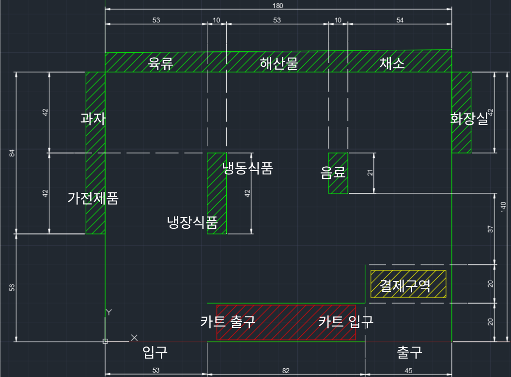

# 미니어처 마트 맵

> **실제 크기:** 180 × 140 cm
> **좌표 원점:** 맵 하단 좌측 (카트 출구 부근)

---

## 맵 레이아웃

---

## 상품 구역 (ID 1~8)

| ID | 구역명 | 설명 | Nav2 Waypoint |
|---|---|---|---|
| 1 | 가전제품 | 좌측 하단 진열대 | 미정 |
| 2 | 과자 | 좌측 상단 진열대 | 미정 |
| 3 | 해산물 | 상단 진열대 좌 | 미정 |
| 4 | 육류 | 상단 진열대 중 | 미정 |
| 5 | 채소 | 상단 진열대 우 | 미정 |
| 6 | 음료 | 중앙 우측 진열대 | 미정 |
| 7 | 베이커리 | 중앙 좌측 진열대 왼쪽 | 미정 |
| 8 | 음식 | 중앙 좌측 진열대 오른쪽 | 미정 |

---

## 특수 구역 (ID 100~)

| ID | 구역명 | 설명 | Nav2 Waypoint / 좌표 임계값 |
|---|---|---|---|
| 100 | 화장실 | 우측 상단 | 미정 |
| 110 | 입구 | 하단 좌측 | 미정 |
| 120 | 출구 | 하단 우측 | 미정 |
| 130 | 카트 입구 | 하단 중앙 우 — 로봇 대기 구역 시작점 | 미정 |
| 140 | 카트 출구 (대기열 1번) | 하단 중앙 좌 — 로봇 귀환 목적지. 대기열 맨 앞 (사용자 QR 스캔 위치) | 미정 |
| 141 | 카트 출구 (대기열 2번) | ID 140 바로 뒤 — 2번째 로봇 대기 위치 (scenario_18) | 미정 |
| 142 | 카트 출구 (대기열 3번) | ID 141 바로 뒤 — 3번째 로봇 대기 위치 (scenario_18) | 미정 |
| 150 | 결제 구역 | 우측 하단 — 자동 결제 트리거 구역 | 미정 |

> **Waypoint 좌표는 Nav2 맵 생성 후 실측하여 채워야 합니다.**

---

## 복귀 통행 제한 구역 (Keepout Filter)

로봇이 **RETURNING / TOWARD_STANDBY** 상태일 때만 적용되는 Nav2 Keepout Filter 마스크입니다.
`shoppinkki_nav/config/keepout_mask.pgm` 에 흰색(255) 픽셀로 표시하며,
`lifecycle_manager_filter`(autostart=false)를 통해 BTReturning이 동적으로 활성/비활성화합니다.

| 구역 | 설명 | 마스크 처리 |
|---|---|---|
| 상품 진열대 통로 (zone 1~8 사이 공간) | 쇼핑 중인 고객과 충돌 방지 | 흰색 (통행 금지) |
| 메인 복귀 통로 | 대기열(zone 140~142)로 이어지는 지정 경로 | 검정 (통행 가능) |

> **마스크 작성 방법:** `shop.pgm`을 복사 후 GIMP 등으로 금지 구역을 흰색으로 칠한다.
> 실측 맵 완성 후 좌표를 확인하여 `keepout_mask.yaml`의 resolution/origin과 일치시킬 것.

---

## 도난 감지 경계

마트 내부 전체 영역을 벗어나면 도난으로 판정합니다.
맵 외곽 좌표 임계값으로 정의하며, Nav2 맵 생성 후 실측값으로 확정합니다.
