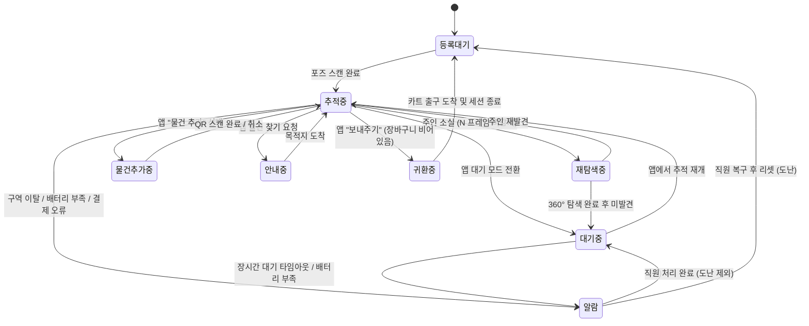

# 로봇 상태 머신 (State Machine)

> **프로젝트:** 쑈삥끼 (ShopPinkki)
> **팀:** 삥끼랩 | 에드인에듀 자율주행 프로젝트 2팀

쑈삥끼의 동작 모드 전환을 State Machine으로 정의합니다.
주행/회피 세부 로직은 별도 Behavior Tree(`docs/behavior_tree.md`)로 분리합니다.

---

## 상태 다이어그램



---

## 상태 정의

| 상태 | 설명 | LED | 진입 조건 |
|---|---|---|---|
| 등록 대기 | 포즈 스캔 전 초기 상태. QR 코드 LCD 표시 | 파란색 | 최초 기동 / 귀환 완료 |
| 추적 중 | YOLOv8n + ReID로 주인 인식 및 P-Control 추종 | 초록색 | 포즈 스캔 완료 / 재발견 / 모드 복귀 |
| 재탐색 중 | 주인 소실 후 제자리 회전으로 재탐색 (SR-37) | 주황색 | 추적 중 N 프레임 연속 미감지 |
| 대기 중 | 추종 정지. 통행 방해 시 LiDAR로 자동 회피 (SR-36) | 파란색 | 재탐색 실패 / 앱 수동 전환 |
| 물건 추가 중 | 추종 일시 정지, 카메라 QR 스캔 모드로 전환 (SR-42) | 하늘색 | 앱 "물건 추가" 선택 |
| 안내 중 | Nav2 Waypoint로 진열대 이동 (SR-35) | 노란색 | 앱 물건 찾기 요청 |
| 귀환 중 | Nav2로 카트 출구(ID 140) 복귀 (SR-35, SR-84) | 보라색 | 앱 "보내주기" (장바구니 비어있음) |
| 알람 | 직원 호출. 이동 정지 | 빨간색 점멸 | 구역 이탈 / 배터리 부족 / 장시간 대기 / 결제 오류 |

---

## 전환 정의

| From | To | 트리거 | 조건 |
|---|---|---|---|
| 등록 대기 | 추적 중 | 포즈 스캔 완료 이벤트 | 4방향 스캔 모두 완료 |
| 추적 중 | 재탐색 중 | 주인 소실 감지 | N 프레임 연속 미감지 (N은 구현 시 확정) |
| 추적 중 | 물건 추가 중 | 앱 명령 | WebSocket `mode=ITEM_ADDING` |
| 추적 중 | 안내 중 | 앱 명령 | WebSocket `find_product` 요청 + 유효 상품명 |
| 추적 중 | 대기 중 | 앱 명령 | WebSocket `mode=WAITING` |
| 추적 중 | 귀환 중 | 앱 명령 | WebSocket `mode=RETURNING` + 장바구니 비어있음 |
| 추적 중 | 알람 | 구역 이탈 감지 | AMCL pose가 shop_boundary 초과 (SR-32) |
| 추적 중 | 알람 | 결제 오류 | 결제 구역 진입 후 가상 결제 실패 (SR-34) |
| 재탐색 중 | 추적 중 | 주인 재발견 | YOLOv8n + ReID 매칭 성공 |
| 재탐색 중 | 대기 중 | 탐색 실패 | 360° 회전 완료 후 미발견 (SR-37) |
| 대기 중 | 추적 중 | 앱 명령 | WebSocket `mode=TRACKING` |
| 대기 중 | 알람 | 장시간 대기 타임아웃 | 대기 시작 후 일정 시간 경과 (시간은 구현 시 확정) |
| 물건 추가 중 | 추적 중 | QR 스캔 완료 | 유효 QR 코드 인식 |
| 물건 추가 중 | 추적 중 | 취소 | 앱 "취소" 또는 타임아웃 |
| 안내 중 | 추적 중 | 목적지 도착 | Nav2 Goal 성공 |
| 귀환 중 | 등록 대기 | 도착 및 세션 종료 | Nav2 Goal 성공 + SESSION 종료 + POSE_DATA 삭제 |
| 알람 | 대기 중 | 직원 처리 완료 | 배터리 / 장시간 대기 / 결제 오류 알람 해제 |
| 알람 | 등록 대기 | 직원 복구 후 리셋 | 도난 알람 해제 (세션 강제 종료) |
| 모든 상태 | 알람 | 배터리 부족 | battery_level ≤ 임계값 (SR-90) |

---

## 구현 노트

### 라이브러리
- **`py_trees`** — 상태 머신을 트리 구조로 표현. 각 상태를 `Behaviour`로 구현
- **`py_trees_ros`** — ROS 2 토픽/액션과 연동 (WebSocket 명령, AMCL pose 구독 등)
- **`py_trees_ros_viewer`** — 런타임 트리 시각화

### 구조
```
ShoppinkkiStateMachine (Selector)
├── AlarmGuard (항상 최우선 — 배터리/도난 감지)
├── Returning
├── Guiding
├── ItemAdding
├── Tracking
│   └── ReSearching (추적 실패 시 서브트리)
├── Waiting
└── IdleRegistration
```

### ROS 토픽 연동
| 항목 | 방식 |
|---|---|
| 현재 상태 발행 | `/pinky/mode` (`std_msgs/String`) |
| 앱 모드 전환 명령 수신 | WebSocket → 블랙보드 쓰기 |
| AMCL 구역 이탈 감지 | `/pinky/pose` 구독 → 블랙보드 쓰기 |
| 배터리 잔량 감지 | pinkylib polling → 블랙보드 쓰기 |
