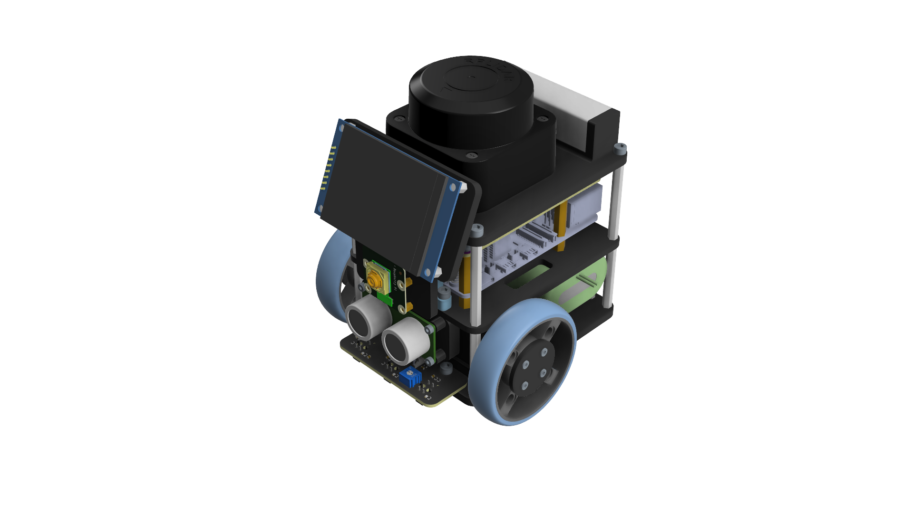

# Pinky Pro
ROS2 packages for Pinky Pro


---
### Pinky Pro ROS2 아키텍처


## 💡 Pinky Pro 전용 GPT에게 모르는 건 물어보세요!
* **[Pinky Assistants (ChatGPT)](https://chatgpt.com/g/g-69141c60b0908191975d16ce2421b768-pinky-pro-assistants)**

## 📚 문서 및 가이드 (Documentation)
* **[Pinky Pro 소개](https://github.com/pinklab-art/pinky_study/wiki)**

* **[초기 설정](https://github.com/pinklab-art/pinky_study/wiki/0.-%EC%B4%88%EA%B8%B0%EC%84%A4%EC%A0%95(PinkyPro))**

* **[수업 자료 (Part 1)](https://github.com/pinklab-art/pinky_study/wiki/2.1-Pinky-Pro(part1))**

* **[수업 자료 (Part 2)](https://github.com/pinklab-art/pinky_study/wiki/2.2-Pinky-Pro(part2))**

* **[수업 자료 (Part 3)](https://github.com/pinklab-art/pinky_study/wiki/2.3-Pinky-Pro(part3%E2%80%90%EC%8B%9C%EB%AE%AC%EB%A0%88%EC%9D%B4%EC%85%98))**

* **[수업 자료 (Part 4)](https://github.com/pinklab-art/pinky_study/wiki/2.4-Pinky-Pro(part4%E2%80%90%EC%8B%A4%EB%AC%BC%EB%A1%9C%EB%B4%87%ED%99%9C%EC%9A%A9))**
   

## 🙏 Special Thanks · Contributors

**[byeongkyu](https://github.com/byeongkyu)** – Pinky PRO 모델 ROS 2 패키지 개발  
참고 레포지토리: [pinky_robot](https://github.com/byeongkyu/pinky_robot)

# 💻 PC 설정

## 환경
* **OS:** Ubuntu 24.04
* **ROS:** ROS2 Jazzy
* **Architecture:** x86\_64 (amd64) (Recommended)
    * (ARM64 환경의 경우 [관련 문서](doc/arm64_guide.md)를 참고하세요.)

---

## 1. Pinky Pro ROS2 pkg clone

```
mkdir -p ~/pinky_pro/src
cd ~/pinky_pro/src
git clone https://github.com/pinklab-art/pinky_pro.git
```
## 2. dependency 설치
```
cd ~/pinky_pro
rosdep install --from-paths src --ignore-src -r -y
```
## 3. build
```
cd ~/pinky_pro
colcon build
```

# Pinky Pro 사용 매뉴얼

## 환경
- ubuntu 24.04
- ros2 jazzy

## pinky Pro 실행
```
ros2 launch pinky_bringup bringup_robot.launch.xml
```

## Map building
#### launch slam toolbox
```
ros2 launch pinky_navigation map_building.launch.xml
```
#### [ONLY PC] map view 
```
ros2 launch pinky_navigation map_view.launch.xml
```
#### robot keyborad control
```
ros2 run teleop_twist_keyboard teleop_twist_keyboard 
```
#### map save 
```
ros2 run nav2_map_server map_saver_cli -f <map name>
```

## Navigation2 
#### launch navigation2
```
ros2 launch pinky_navigation bringup_launch.xml map:=<map name>
```

#### [ONLY PC] nav2 view
```
ros2 launch pinky_navigation nav2_view.launch.xml
```

# 시뮬레이션
## pinky Pro gazebo 실행
#### 가제보 실행
```
ros2 launch pinky_gz_sim launch_sim.launch.xml
```

## Map building
#### launch slam toolbox
```
ros2 launch pinky_navigation gz_map_building.launch.xml
```
#### [ONLY PC] map view 
```
ros2 launch pinky_navigation gz_map_view.launch.xml
```
#### robot keyborad control
```
ros2 run teleop_twist_keyboard teleop_twist_keyboard 
```
#### map save 
```
ros2 run nav2_map_server map_saver_cli -f <map name>
```

## Navigation2 
#### launch navigation2
```
ros2 launch pinky_navigation gz_bringup_launch.xml map:=<map name>
```

#### [ONLY PC] nav2 view
```
ros2 launch pinky_navigation gz_nav2_view.launch.xml
```

# 센서 동작
## LED control
### LED server start
```
ros2 run pinky_led led_server
```
### LED service call
#### fill with color
```
ros2 service call /set_led pinky_interfaces/srv/SetLed "{command: 'fill', r: 255, g: 0, b: 0}"
```
#### set pixel colors
```
ros2 service call /set_led pinky_interfaces/srv/SetLed "{command: 'set_pixel', pixels: [4, 5, 6, 7], r: 0, g: 0, b: 255}"
```
#### clear
```
ros2 service call /set_led pinky_interfaces/srv/SetLed "{command: 'clear'}"
```
#### set brightness
```
ros2 service call /set_brightness pinky_interfaces/srv/SetBrightness "{brightness: 10}"
```
## LCD control
### emotion server start
```
ros2 run pinky_emotion emotion_server
```
or
```
ros2 run pinky_emotion emotion_server --ros-args -p load_frame_skip:=3
```

### set emotion
Available emotions: (hello, basic, angry, bored, fun, happy, interest, sad)
```
ros2 service call /set_emotion pinky_interfaces/srv/Emotion "{emotion: 'happy'}"
```

# 웹 서버
## Start web server
### Real Robot
Launch SLAM web server
```
ros2 launch pinky_navigation web_slam.launch.xml
```

Or launch Nav2 web server
```
ros2 launch pinky_navigation web_nav2.launch.xml map:=<map name>
```

With custom IP address (Optional)
```
ros2 launch pinky_navigation web_nav2.launch.xml map:=<map name> ip:=0.0.0.0
```
### Simulation (Gazebo)
Launch SLAM web server
```
ros2 launch pinky_navigation gz_web_slam.launch.xml
```

Or launch Nav2 web server
```
ros2 launch pinky_navigation gz_web_nav2.launch.xml map:=<map name>
```

With custom IP address (Optional)
```
ros2 launch pinky_navigation gz_web_nav2.launch.xml map:=<map name> ip:=0.0.0.0
```

## Web Access
**Default (Real Robot):**
[`http://192.168.4.1:8080`](http://192.168.4.1:8080)

**Default (Simulation):**
[`http://localhost:8080`](http://localhost:8080)

**If you specified a custom IP:**
`http://<host_ip>:<port>`

# 🛠️ 트러블슈팅 (Troubleshooting)

## 공유기 과부하로 인한 로봇 통신 끊김 및 지연 현상 해결 방법
여러 대의 Pinky Pro를 동일한 공유기에 연결하여 단체로 운영하거나 주행할 때, **ROS2 DDS 통신 트래픽으로 인한 공유기 성능 한계** 때문에 로봇의 통신이 끊기거나 움직임이 원활하지 않은 이슈가 발생할 수 있습니다.

이러한 현상이 나타나면, 각 Pinky와 사용자(PC) 간의 개별 연결은 유지한 상태에서 **Pinky들이 공통으로 연결된 외부 공유기와의 연결을 해제**하면 통신량이 줄어들어 문제가 해결됩니다.

Pinky Pro의 터미널에서 아래 명령어를 순서대로 입력하여 외부 네트워크 설정을 삭제하고 재부팅해 주세요.

```bash
sudo rm /etc/netplan/90*
sudo reboot
```

**Note:** 이 명령어는 외부 공유기와 연결하기 위해 생성된 netplan 설정 파일(90으로 시작하는 파일)을 삭제하는 명령어입니다. 재부팅 후에는 **로봇이 공유기를 거치지 않고 사용자의 PC와 직접 통신**하는 기본 상태로 돌아가므로, 공유기 성능 한계로 발생하던 지연 현상이 사라집니다. 다시 외부 인터넷 연결이 필요한 경우에는 초기 네트워크 설정 과정을 다시 진행해야 합니다.
